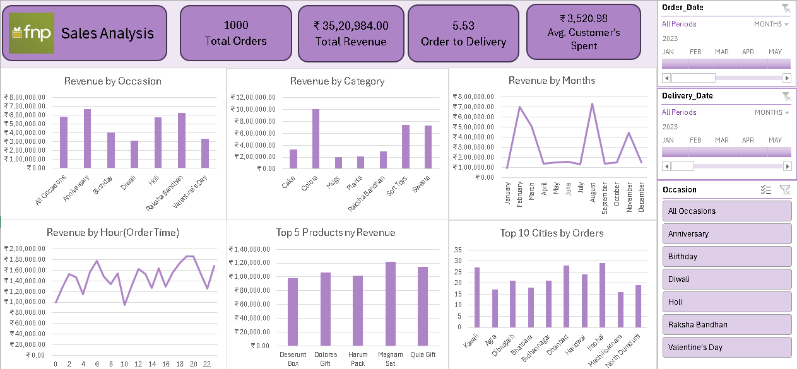

# FNP Sales Analysis 📊

This is a sales analysis dashboard for Ferns N Petals (FNP), created using Microsoft Excel.

## 📁 Project Files
- `FNP_Sales_Analysis.xlsx`: Excel dashboard with interactive filters and charts
- `dashboard.png`: Screenshot of the dashboard

## 📈 Dashboard Features
- Total Orders, Revenue, Avg Spend, Order to Delivery Time
- Revenue analysis by:
  - Occasion
  - Product Category
  - Month
  - Hour of Order
  - Top Products & Cities

## 🔍 Key Insights
- Highest revenue from Raksha Bandhan and Anniversary occasions
- Magnam Set and Quia Gift among top-grossing products
- Peak orders placed between 18:00 and 22:00

## 🛠 Tools Used
- Microsoft Excel
- Pivot Tables
- Charts
- Slicers

## 📷 Dashboard Preview

